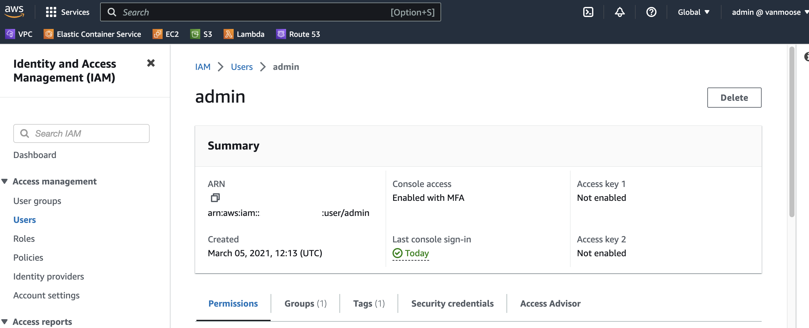
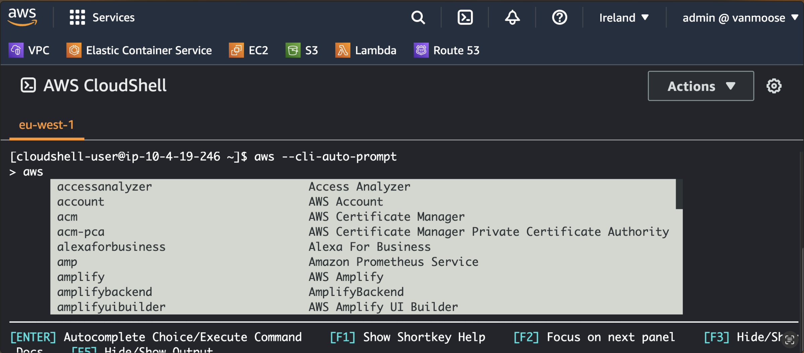
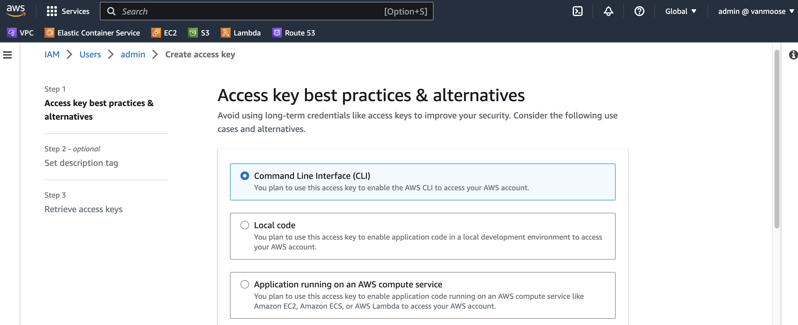
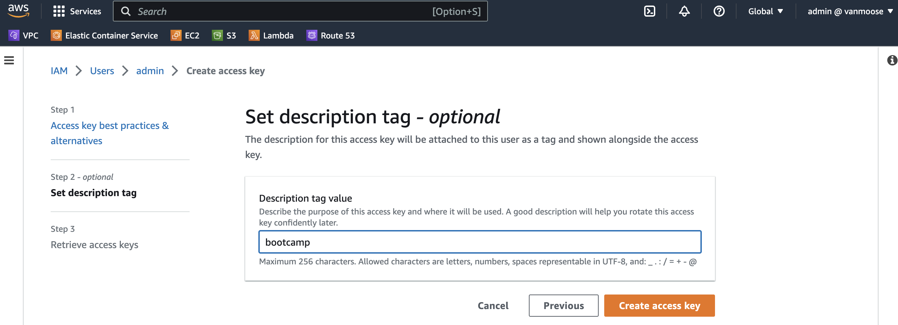
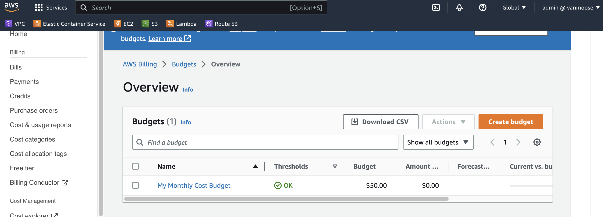
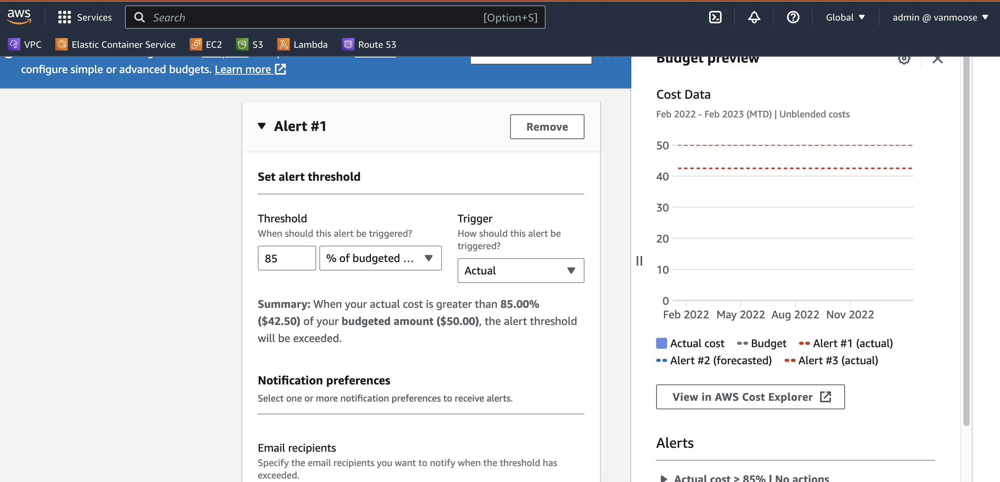

# Week 0 — Billing and Architecture

**************************************

#### **Admin User**
I already had Admin user created previously

**************************************

#### **CloudShell**

**************************************

#### **Generate Acces Keys**

**************************************

#### **Create a Budget**

**************************************

### **Budget Alarms**
Budget alarms are part of my budghet setup

**************************************
### **Conceptual Diagram**
[label](assets/Cloud-Architecture-conceptual.pdf)

https://lucid.app/lucidchart/0ceeadec-71d6-4fd7-bfae-bd73d57fa729/edit?viewport_loc=-48%2C13%2C2110%2C920%2C0_0&invitationId=inv_4dd8aedb-49b5-40d2-beff-b935163dfbaa

**************************************
### **ArchLogical Diagram**
[label](assets/Cloud-Architecture-logical.pdf)

https://lucid.app/lucidchart/0ceeadec-71d6-4fd7-bfae-bd73d57fa729/edit?viewport_loc=-92%2C84%2C2110%2C920%2C.0ByLc4-gatA&invitationId=inv_4dd8aedb-49b5-40d2-beff-b935163dfbaa

**************************************